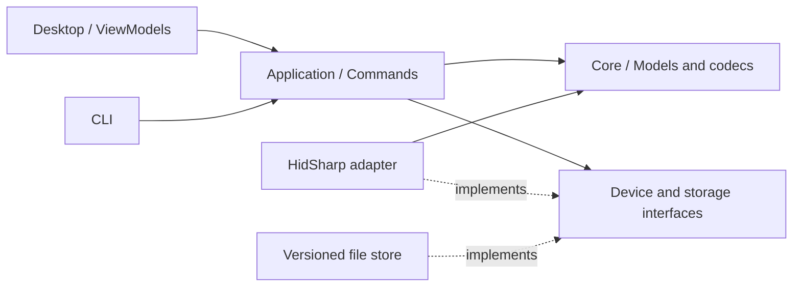

# 02 技术选型与架构

状态：设计基线，关联 D05—D07、D10、D15。依赖版本是工程起点，不表示永久冻结。

## 1. 选型结论

| 项目 | 确定方案 | 维护规则 |
| --- | --- | --- |
| 语言与运行时 | C#、.NET 10 LTS | SDK 由仓库声明并在 CI 固定；采用受支持维护版本 |
| UI | Avalonia，初始 12.1.2 | 复用标准控件、主题和 headless 测试；升级需布局与原生启动回归 |
| HID | HidSharp，初始 2.6.4 | 仅出现在传输适配层；三平台分别验收 |
| 存储 | System.Text.Json、版本化文件、原子替换 | 保留旧格式读取器与迁移测试，不引入通用数据库 |
| 日志 | 本地结构化操作记录和受限滚动日志 | 默认不记录按键内容、宏正文、原始 HID 流或完整备份 |
| 测试 | xUnit、fake transport、Avalonia headless | 单元测试不访问实机、不依赖用户数据目录 |
| 分发 | 自包含包；正式平台包逐步采用各平台规范 | 依赖许可证、校验和、版本清单随包发布 |
| 依赖与来源 | NuGet 锁文件、显式源、MIT 项目许可 | 新依赖审查许可证、原生资产、维护状态和网络行为 |

选择统一 C# 是为了共享协议、编排、CLI 和测试，减少跨语言边界。Tauri/Rust 的优势不足以在没有明确测量结果时抵消协议重做和两套工具链成本；Qt/C++ 也未带来当前必需的独占能力。不引入 Electron、WebView 或内嵌网页 UI。

暂不启用 trimming、NativeAOT 或激进程序集裁剪。先建立平台启动和打包基线，再按体积/启动测量逐项评估，不把压缩体积作为写入正确性的交换条件。

## 2. 目标模块

| 模块 | 责任 | 禁止职责 |
| --- | --- | --- |
| LightHub.Core | 语义模型、协议编码、布局/CRC、驱动编译、快照比较、错误类型 | UI、具体 HID 库、进程检测、系统输入注入 |
| LightHub.Application | 命令编排、会话状态、写入计划、事务执行、支持决策、备份/预设策略 | Avalonia 控件、OS HID 细节 |
| LightHub.Hid | 枚举、报告路由、响应匹配、连接事件、平台权限和进程互斥适配 | 业务层“保存即启用”、预设生命周期 |
| LightHub.Desktop | ViewModel、视图、交互、本地化和命令显示 | 原始 HID 指令、扇区偏移、独立恢复/清理规则 |
| LightHub.Cli | 同一应用服务的命令入口、诊断和显式硬件测试 | 独立一套写入/恢复协议 |
| LightHub.Tests | 模拟设备、故障注入、存储迁移、UI 和契约测试 | 默认运行实机测试或修改用户备份 |

`LightHub.Application` 已是独立类库，包含事务、备份和本地资产服务。宏增量工作复用这条边界，拆分职责时保留测试与必要兼容包装；不要求再次大规模搬动文件。文件存储实现先放在 Application 内部，存在第二实现时再考虑独立基础设施项目。

启动组合根构造依赖。Application 依赖设备接口，不能静态调用 `Hardware.Open`。界面按设备、编辑、预设、备份分 ViewModel；跨区域共享的是受控会话状态，不是全局可变设备对象。

## 3. 设备操作与支持策略

每项操作的支持决策包含：能力标识、允许/禁止/只读、原因、证据引用、驱动版本。能力至少区分 discover、read-profile、read-macro、set-runtime-dpi、write-profile、activate、write-macro、write-gshift、write-lighting、restore-profile、restore-macro。

能力来自协议查询，写入许可来自能力、型号标识、固件范围、布局、传输方式和平台证据的交集。固件范围未知时按观察到的版本限定，不凭同名型号外推。接收器 Product ID 不能替代鼠标身份。

按键位置图属于展示元数据，不参与任何写入权限判断。不可用能力的原因向 UI 和 CLI 提供相同的结构化结果。

## 4. 会话、并发和锁

- 每个接收器/物理 HID 通道使用单一串行请求队列，防止多个槽位的报告交错；不同接收器可独立读取。
- 界面线程不执行枚举、文件遍历、哈希、JSON 解析或阻塞 HID 请求。
- 首版同时仅允许一个持久化事务。存储管理和该事务互斥；锁顺序固定为物理设备租约在先、存储租约在后，清理只取得存储租约。
- 应用进程正常空闲不轮询 HID。设备状态变化来自连接事件和用户明确刷新；电量和运行 DPI 不后台定时读取，避免阻止无线鼠标休眠。后续若提供手动/可选刷新策略，须独立验收。
- 临时试用可保持短期连接，连续输入以 250 ms 合并，只发送最新有效值。持久化保存不会被滑块动作触发。
- 会话附带物理身份、连接代次和能力版本。断连或目标设备变化立即使旧句柄、预览所有权及待执行写命令失效。
- 不把普通 HID 插拔事件一律当成所选设备断开；先比较所选端点拓扑。无线休眠无法自动识别时显示状态陈旧，提供刷新。
- 接收器租约只协调 LightHub 进程，不能宣称锁住所有其他管理软件。检测到已知竞争软件时阻止变更；未知竞争由冲突校验处理。

板载会话不依赖后台服务、宿主脚本或运行时下载插件。持久化事务不自动重试。只读查询是否重试由命令元数据决定，上限一次，必须重新验证连接代次且不把读取失败转成配置写入。

### 可选运行器扩展边界（规划）

宏语义校验和编辑不依赖 HID 或系统输入。Application 提供能力评估和运行状态编排；设备宏编译留在独立 Core 编码器，触发订阅与输入输出通过平台适配接口隔离。软件运行器使用普通用户进程，不安装系统服务。是否需独立进程以 T0 原型测量决定；通过门槛前不建立 RPC、启动项或新后台项目。

运行器事件接收与板载管理器的默认空闲行为分别验收，不把事件订阅变成高频 HID 查询。共享物理通道只能有一个报告读取/分发所有者，禁止运行器与现有 Exchange 同时抢读。当前传输没有异步事件分发能力；任何触发实现必须先完成路由验证。详细接口、权限和生命周期见[实施方案](06-macros-and-runtime.md)。

## 5. 错误与操作记录

应用层错误至少包括 Disconnected、Timeout、Unsupported、PermissionDenied、InvalidData、Conflict、IdentityMismatch、StorageFailure、RecoveryRequired。每个错误有阶段、操作 ID、可重试性和下一步动作；用户可读文本在边界层本地化。

失败消息不能统称“保存失败”：区分写前拒绝、传输中断、回读不一致、写入已验证但本地日志收尾失败。后两种不能直接自动重写。向用户显示验证程度和恢复入口。

记录每个阶段耗时：发现、打开、能力/身份读取、冲突预检、备份、传输、回读、运行状态检查、UI 更新。统计允许在本机导出，不自动上传。

## 6. 平台与权限

Windows 首先验证 x64/Windows 11；Windows 10 和 ARM64 在实际支持矩阵中单列。Linux 首先验证 glibc x64 的明确发行版和桌面会话；macOS 首先验证 ARM64 的明确系统版本。其他架构是构建候选，不自动获得支持声明。

Linux 安装 HID 权限规则可能需要管理员操作，但主程序不以 root 运行。macOS 仅请求实际设备访问所需权限；首版不因基础板载设置申请输入监控或辅助功能注入权限。Windows 使用标准 HID 驱动，普通运行不提权。

跨平台自包含构建和本地测试是两种证据，分别展示。锁、原子替换、原生依赖、显示缩放、文件选择器均需原生测试。

## 7. 重新选型的触发条件

遇到无法在当前适配层修复的 HID 权限/路由缺陷、受支持平台持续无法正确启动，或经剖析证明框架成本违反约定预算且无局部修复时，记录原型对比再修订 D05。一次失败、包体较大或参考项目使用另一语言不足以触发全量重写。
