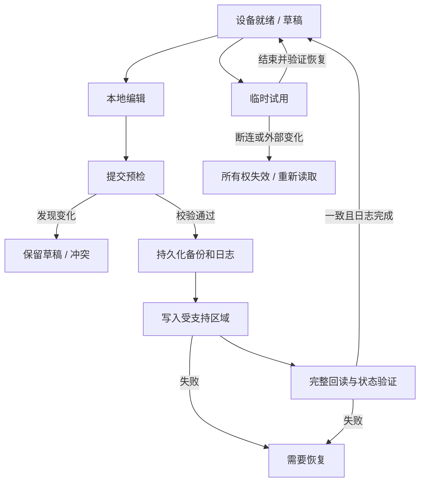

# 03 操作与状态契约

状态：设计基线，关联 D02、D03、D11、D12。这里的“写”指改变设备配置或运行状态的请求，不包括为读取数据而发送的 USB 报告。

## 1. 四类动作

| 动作 | 用户对象 | 是否改变设备 | 成功含义 |
| --- | --- | --- | --- |
| 编辑 | 本地草稿或预设 | 否 | 本地数据有效或清晰标出错误 |
| 保存到板载槽 | 明确设备与槽位 | 是，按写入计划 | 持久内容和约定运行状态完整回读一致 |
| 启用板载槽 | 已存在且有效的槽位 | 是，改变活动状态，必要时显式改变模式 | 活动槽、模式和 DPI 状态已验证 |
| 临时试用 | 当前传感器设置 | 是，不宣称持久保存 | 当前设置已回读，属于当前试用会话 |

“保存到本地预设”是本地存储动作，不等同“保存到板载槽”。草稿有效也不等同设备支持写入。恢复备份独立于上述四类动作。

## 2. 状态模型

采用四个正交维度，不用一个不断增长的布尔集合拼接界面状态。

| 维度 | 状态 | 关键约束 |
| --- | --- | --- |
| 连接 | Disconnected、Connecting、Ready、Unavailable | Ready 才可发送配置变更；Unavailable 含休眠/权限异常等有原因的不可用状态 |
| 操作 | Idle、Reading、Previewing、Writing、Verifying、Restoring | 同一物理通道串行；Writing/Verifying/Restoring 禁止编辑触发新的设备命令 |
| 草稿 | Clean、Dirty、Invalid、Conflicted | Dirty 可离线保留；Invalid/Conflicted 禁止提交 |
| 恢复 | None、Required | Required 禁止普通保存、启用和试用；允许读取、导出及经过验证的恢复 |

状态由应用服务发布不可变快照，UI 根据状态和能力显示可用命令。备份页选择行为不修改设备草稿；语言切换和窗口尺寸变化不改变设备设置。

图中只展示主路径，取消、关闭和模式变更按下面的决策表执行。

## 3. 命令决策表

| 命令 | 前置条件 | 失败/冲突结果 |
| --- | --- | --- |
| 发现/读取 | 无持久写事务；读取同样服从通道队列 | 不改设备；保留已有草稿，不把缓存标成新读结果 |
| 编辑/命名/复制 | 不在持久写或恢复阶段 | 本地错误不触发 HID；新值保持可修正 |
| 保存本地预设 | 草稿语义可序列化；存储可用 | 原文件保留，展示存储错误 |
| 保存板载槽 | Ready、能力允许、草稿有效、无恢复需求、试用已结束 | 写前失败无设备写入；写后失败进入恢复状态 |
| 启用槽位 | Ready、槽有效、能力允许、无恢复需求、无未决试用 | 启用另一槽前处理当前草稿；不自动写草稿 |
| 开始/调整试用 | Ready、该运行时能力允许、无恢复需求 | 失败后标记实际状态未知，禁止把输入框值当真实设备值 |
| 结束试用 | 同一设备代次且试用所有权可确认 | 不满足条件时不恢复、不排队稍后恢复；要求读取 |
| 恢复备份 | 同一物理身份、布局匹配、恢复驱动覆盖所有差异 | 不支持区域不同即拒绝；保留恢复材料 |
| 删除/清理备份 | 存储租约可取得、无受保护引用 | 全批次先校验；部分 I/O 失败须如实显示已处理与剩余项 |

## 4. 关键工作流

### W01：首次连接与设备模式

启动只枚举与读取。优先回到用户上次选择的仍存在设备，不自动应用上次预设。显示读取到的真实 mode、活动槽和当前 DPI；没有读到的值显示未知/陈旧，不能填入猜测的默认值。

设备处于 host 模式时，允许查看、导出和本地编辑。进入板载模式是独立操作，先显示要启用的有效槽。若该设备没有已验证的模式切换路径，禁止切换和相关写入，不借其他命令隐式切换。

### W02：编辑并保存备用槽

选择槽 B，只改变编辑对象；槽 A 继续运行。用户编辑后点击“保存到槽 B”，看到目标和差异。预检后备份、写入、回读。成功后 B 更新，但 A、模式和当前 DPI 档位不变。需要用 B 时，用户另行点击“启用槽 B”。

若底层固件只能通过改变活动状态完成写入，驱动须有恢复旧状态的完整证据；无法满足契约时该路径不开放。不能用默认勾选框把技术限制变成隐式用户同意。

### W03：修改活动槽的按键或 DPI

只改按键时保留当前有效 DPI 档位和对应速度。修改当前档位数值会改变速度，这属于用户明确编辑的结果；差异预览应指出“当前生效档位”。修改默认档位不自动切换当前档位。

如果删除/禁用当前档位，提交被阻止，要求选择新的生效档位；如果模式或活动槽已被外部改变，进入冲突处理。固件重载可能清除临时 DPI 覆盖，因此所有持久保存前必须先结束试用。

### W04：临时 DPI 试用

输入候选值本身不写设备。点击“试用”后创建会话，记录物理身份、连接代次、真实起始 DPI、mode/活动槽/当前档位和最近一次成功设置值。会话中连续有效输入以 250 ms 合并，单次回读成功才更新实际值显示。

点击“结束试用”时重新核对同一设备、连接代次和相关运行状态。仅在实际状态仍与会话预期一致时恢复起始 DPI，并回读。LightHub 的锁不代表排除所有外部程序，因此状态不明时宁可提示未恢复，也不覆盖可能属于其他程序的新状态。

“把试用值保存到板载”先要求明确目标槽/档位并展示差异，再结束试用、验证恢复、执行普通保存流程。不会自动把任意临时数值塞进默认档位。

断连、休眠后重连、进程崩溃均使试用所有权失效。再次启动只读设备，并提示上次试用未确认结束；不自动回放旧的恢复命令。

### W05：切设备、切预设与关闭

未保存草稿可存为本地草稿/预设、放弃或取消切换。默认选择不会丢弃数据。草稿自动暂存仅落本地文件，不写硬件；错误或崩溃后的草稿恢复也不自动应用。

窗口关闭时：无草稿/无试用即可退出；有草稿先提供保存本地或放弃；有试用尝试受控结束；持久写入或恢复已进入写阶段则等待完成/失败，不强行中断。设备已断开导致试用不能恢复时，允许关闭并记录未确认结果，不宣称恢复成功。

### W06：冲突与重连

冲突时保留“基线、用户草稿、重新读取结果”。初版提供重新加载设备、把草稿存为本地预设、重新基于设备版本编辑三种明确动作，不做自动三方合并。若用户重用草稿，必须重新验证全部能力和差异。

无关 HID 设备插拔不清空当前草稿。所选设备重连必须重新验证身份与布局；同型号的另一只鼠标不继承旧设备未完成的写命令。

### W07：失败恢复

写前错误只影响本次操作。已发出变更请求后出现超时、断连、回读不一致，保留日志并进入恢复流程。恢复页展示已知设备、事务阶段、可用备份和缺失证据，不能让用户靠复制 GUID 文件名猜选项。

有有效同设备备份且恢复驱动覆盖差异时，先保存当前可读原始状态，再恢复并完整验证。无法读取或涉及未知扇区时停止自动处理，允许导出诊断和保留所有恢复材料。

## 5. 取消、成功与状态显示

读取、导入解析、写前预检允许取消。第一条变更请求之后不在闪存块中途响应取消；只在明确安全边界停止。请求超时不意味着请求没有执行。

“已保存到设备”只在内存、运行状态和事务收尾均达到约定后显示。设备已验证但本地收尾失败时显示这一确切事实，并保留人工核对入口；不能把它等价成“未写入，可以自动再试”。

这些操作语义必须同时用于 CLI 和桌面端。CLI 显式提供 save、activate、preview/restore 等边界，不用一个含糊命令隐藏模式切换。
